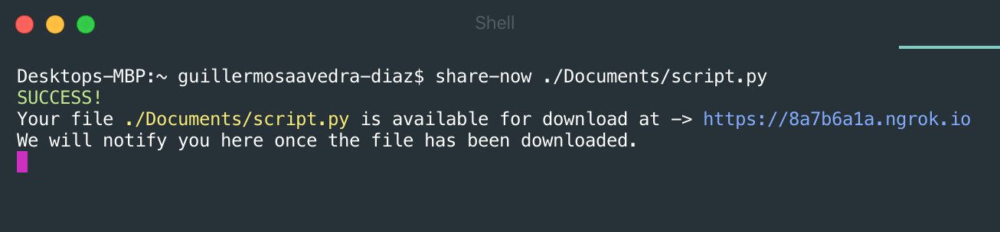
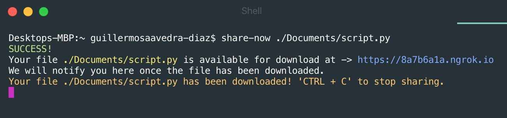

### ShareNow

ShareNow is the fastest way to share any local file by generating a public URL straight from your terminal!

#### Prerequisite

Must have NPM installed

https://docs.npmjs.com/downloading-and-installing-node-js-and-npm

#### Getting Started

```console
foo@bar:~$ npm install -g share-now
```

```console
foo@bar:~$ share-now FILE_PATH
```

#### Screenshots



