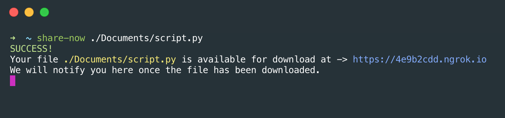
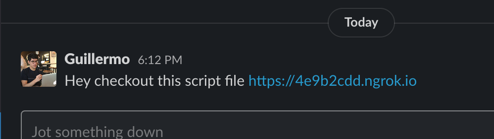

### ShareNow CLI

Instantly share any local file straight from your terminal 🚀

#### Prerequisite

Must have NPM installed

https://docs.npmjs.com/downloading-and-installing-node-js-and-npm

#### Installation

```console
foo@bar:~$ npm install -g share-now
```
#### Getting Started

```console
foo@bar:~$ share-now FILE_PATH
```

#### Screenshots





